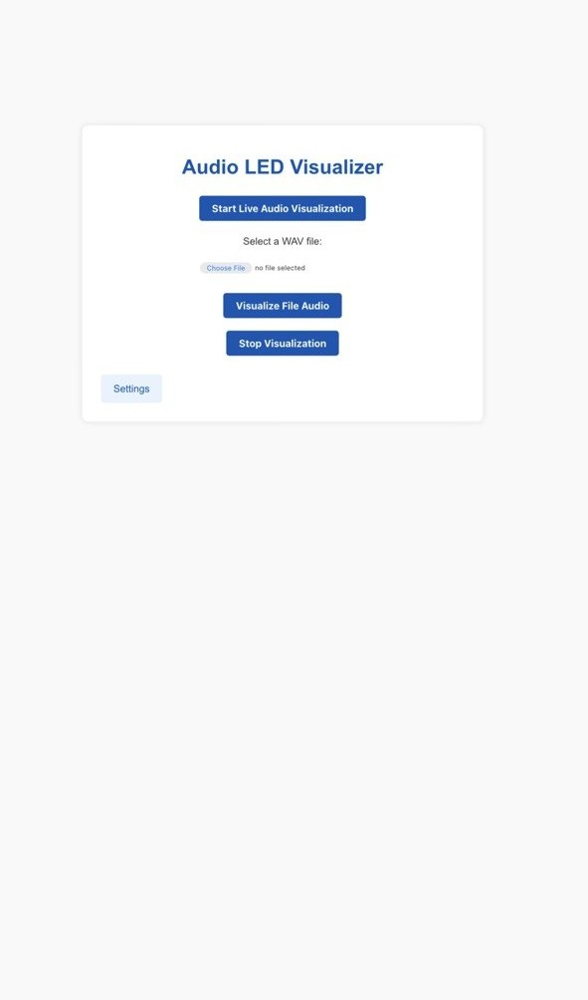
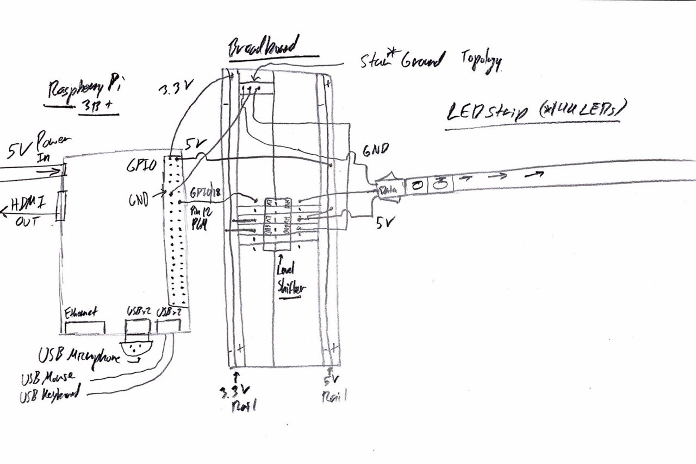
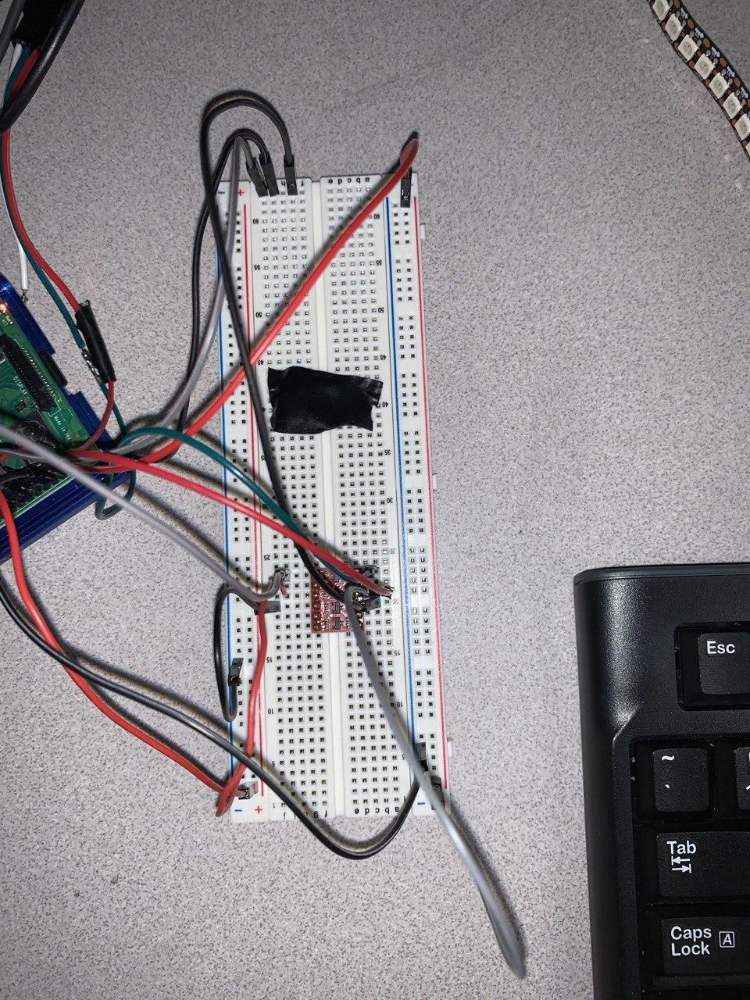
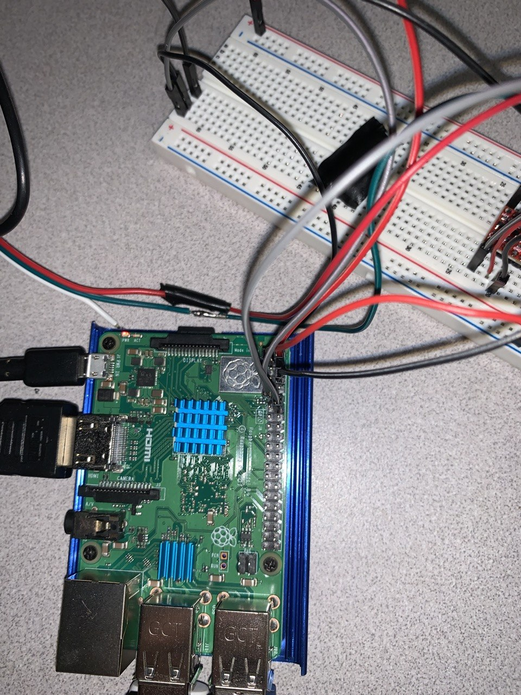
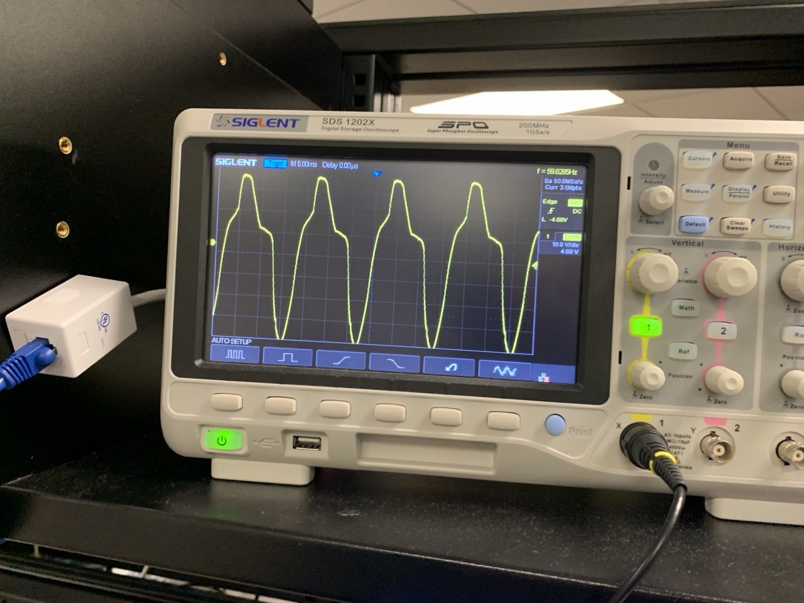

# Raspberry Pi Audio LED Visualizer

A Flask web application that turns a **WS2812B addressable LED strip** into an audio-reactive volume meter. Run it on a Raspberry Pi, open the dashboard from another device on the local network, and visualize either live USB microphone input or an uploaded WAV file.

<video src="media/first-35-seconds-demo.mp4" controls width="720">
  <a href="media/first-35-seconds-demo.mp4">Download overview demo</a>
</video>



## Features

- Live visualization from a USB microphone
- Upload and visualize 16-bit PCM `.wav` files
- 144-LED WS2812B configuration by default
- Rainbow and single-color display modes
- Adjustable strip brightness and RGB values
- Safe start/stop handling with automatic LED cleanup
- Mock LED mode when developed on a non-Raspberry Pi computer
- Responsive Flask dashboard

Live microphone visualization on the LED strip:

<video src="media/audio-visualizer-microphone-demo.mp4" controls width="720">
  <a href="media/audio-visualizer-microphone-demo.mp4">Download microphone demo</a>
</video>

## Hardware

- Raspberry Pi 3B+ or newer
- WS2812B LED strip (144 LEDs configured by default)
- 5 V external power supply sized for the strip
- 74AHCT125/SN74AHCT125 level shifter recommended
- USB microphone
- Common ground between the Raspberry Pi, level shifter, LED strip, and external power supply

> **Power warning:** Do not power a 144-pixel strip from the Raspberry Pi 5 V pin. At full white, the theoretical maximum can approach 8.6 A. Use an appropriately fused external supply and inject power as needed.

Default signal wiring:

| Connection | Default |
|---|---:|
| LED data GPIO | GPIO 18 / PWM0 |
| LED supply | External 5 V |
| Raspberry Pi logic | 3.3 V through level shifter |
| Grounds | All connected together |

### Wiring reference

Hand-drawn schematic from early bring-up (Raspberry Pi 3B+, level shifter, 144-LED strip, star ground). The sketch routes strip power from the Pi 5 V pin for clarity; **use an external 5 V supply for the strip in practice** (see power warning above).



Level shifter and star-ground wiring on the breadboard:



GPIO header connections on the Raspberry Pi:



## Project structure

```text
cse525-final-project/
├── app.py                         # Application entry point
├── audio_led_visualizer/
│   ├── __init__.py                # Flask application factory
│   ├── controller.py              # Visualization thread lifecycle
│   ├── hardware.py                # Real/mock LED strip abstraction
│   ├── routes.py                  # Flask routes
│   └── visualizer.py              # Audio processing and LED output
├── static/css/styles.css
├── templates/
│   ├── base.html
│   ├── index.html
│   ├── live.html
│   ├── file.html
│   ├── settings.html
│   └── 404.html
├── images/                        # Hardware photos, schematics, and UI screenshots
├── media/                         # Demo clips (overview + live microphone)
├── archive/                       # Superseded prototypes (see archive/README.md)
├── tests/test_app.py
├── uploads/.gitkeep
├── requirements.txt
├── requirements-dev.txt
└── .gitignore
```

## Raspberry Pi setup

### 1. Install system packages

```bash
sudo apt update
sudo apt install -y python3-venv python3-dev portaudio19-dev libasound2-dev build-essential
```

### 2. Clone and enter the repository

```bash
git clone https://github.com/Obie342/cse525-final-project.git
cd cse525-final-project
```

### 3. Create a virtual environment

```bash
python3 -m venv .venv
source .venv/bin/activate
python -m pip install --upgrade pip
pip install -r requirements.txt
```

### 4. Run the server

Access to PWM/GPIO commonly requires root privileges. Preserve the virtual environment path when using `sudo`:

```bash
sudo .venv/bin/python app.py
```

Open the dashboard from another device on the same network:

```text
http://<raspberry-pi-ip>:5000
```

Find the Pi address with:

```bash
hostname -I
```

## Configuration

Edit the defaults in `audio_led_visualizer/__init__.py`:

```python
LED_COUNT = 144
LED_PIN = 18
LED_BRIGHTNESS = 255
AUDIO_RATE = 44_100
AUDIO_CHUNK_SIZE = 1024
AUDIO_INPUT_DEVICE_INDEX = None
```

To identify microphone device indexes:

```bash
python -c "import pyaudio; p=pyaudio.PyAudio(); [print(i, p.get_device_info_by_index(i)['name']) for i in range(p.get_device_count())]; p.terminate()"
```

Then set `AUDIO_INPUT_DEVICE_INDEX` to the desired index.

## WAV file support

The current file visualizer accepts uncompressed **16-bit PCM WAV** files. Stereo files are mixed down to mono before visualization. Uploaded files are stored under `uploads/`, which is excluded from Git except for `.gitkeep`.

## Development and tests

On Windows, macOS, or Linux without Raspberry Pi hardware, the application automatically uses an in-memory mock strip. The UI can still be developed and tested, although no physical LEDs are controlled.

```bash
pip install -r requirements-dev.txt
pytest
python app.py
```

## Troubleshooting

**LEDs do not light:** Verify the GPIO number, LED direction, common ground, level shifter wiring, external power, and whether the process has GPIO permissions.

**Live mode immediately stops:** Check the dashboard for the captured error, verify the USB microphone with `arecord -l`, and set the input device index when necessary.

**PyAudio fails to install:** Install `portaudio19-dev`, `libasound2-dev`, `python3-dev`, and `build-essential`, then retry inside the virtual environment.

**Flickering or random colors:** Use a proper 3.3 V-to-5 V logic-level shifter, keep the data wire short, add a small series resistor on the data line, and ensure the power supply ground is shared with the Pi.

## Background

This project began as a CSE 525 final project exploring real-time audio processing, Flask, Raspberry Pi GPIO/PWM, and individually addressable LEDs. The refreshed layout separates the web layer, audio processing, hardware access, and thread management so the project is easier to understand and extend. The shipped visualizer maps audio **RMS level** to a bar-style meter; an earlier **FFT-based** monolith is preserved in [`archive/main_test3_fft_monolith.py`](archive/main_test3_fft_monolith.py).

Oscilloscope capture from early hardware bring-up (~60 Hz test signal), before the RMS bar algorithm was finalized:



## License

MIT — see [LICENSE](LICENSE).
